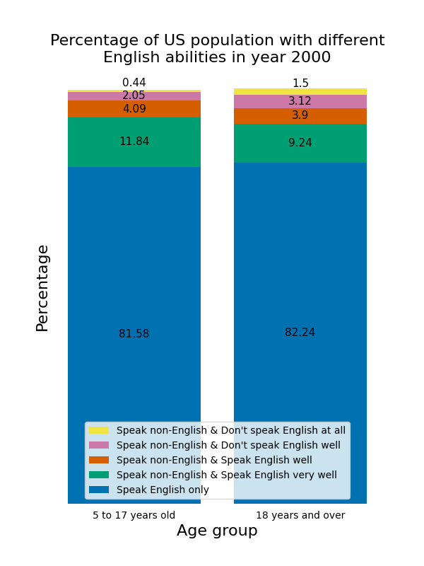

# Project description
This is my project for the *Applied Plotting, Charting & Data Representation in Python* course by University of Michigan, taken on Coursera.

It mainly uses Pandas, NumPy and Matplotlib to answer the research question:
**In year 2000, did US population from different age groups have different English language abilities?**

Data source: US Census https://www2.census.gov/programs-surveys/decennial/2000/phc/phc-t-20, specifically Table 2 for Population 5 to 17 Years and Table 3 for Population 18 Years and Over.    

# Result

In year 2000, there were some differences in English language abilities among US population who were 5-17 years old vs. 18 years old and over.
* 1.5% of people aged 18 years and over did not speak English at all and 3.12% did not speak English well. These percentages are higher than those of people aged 5-17 years old, among whom 0.44% did not speak English at all and 2.05% did not speak English well.
* There were more people in the 5-17 years old group who spoke a non-English language at home but also spoke English very well (11.84%), than people aged 18 years and over with similar abilities (9.24%).
* The percentages of monolingual English speakers do not differ much in the two age groups (81.58% for the younger group and 82.24% for the older group).