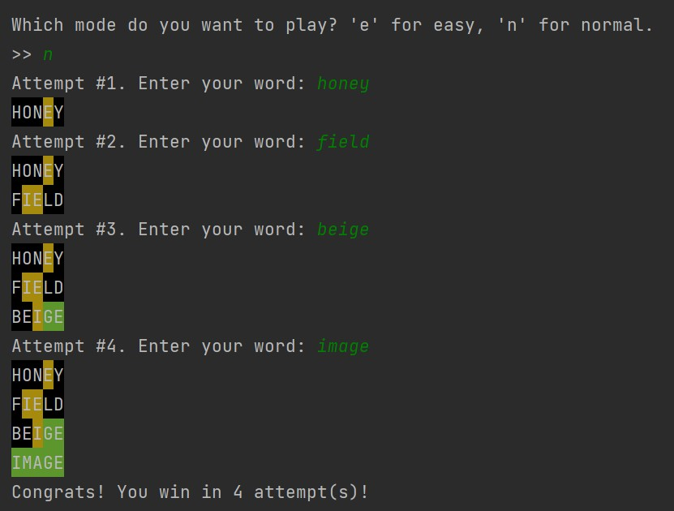

# Project description
This code was written in February 2022, about one and a half month after I started learning Python.

Wordle is a five-letter word guessing game. Original game at https://www.nytimes.com/games/wordle/index.html

In the original game, guesses must be real words.
In this game, I added an easy mode option, in which guesses can be non-words.

# Example
The following screenshot shows the game played in the normal mode.

