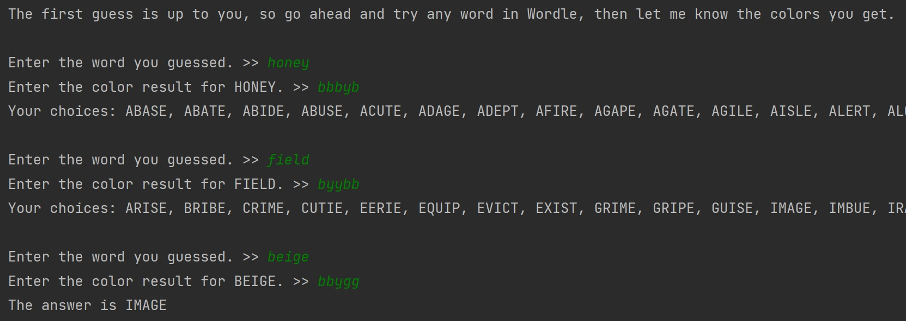

# Story behind this project
After creating [my first Python project, mimicking the Wordle game](https://github.com/WoramonP/portfolio/tree/main/Wordle), I created this Wordle solver.

It helps users find possible answers for the Wordle game based on what they guessed and the green, yellow, black (grey) results they got.

The *challenge* for this project is to correctly eliminate the known yellow or grey characters. It may sound easy at first, but thinking of it, black letters aren't always "bad" letters. 
For example, when the correct word is "IMAGE" and your guess is "BEIGE", the last "E" will be green and the other one will be black. So, we cannot simply eliminate the letter "E" just because we find one that is black.

As I wrote this code after I started learning Python for 2.5 months, it was a great practice for me on how to use Python list and dictionary.

# Example
In this example, the target word that we are trying to guess is IMAGE.

For the color results, G is for Green, Y is for Yellow, B is for Black/Grey.

