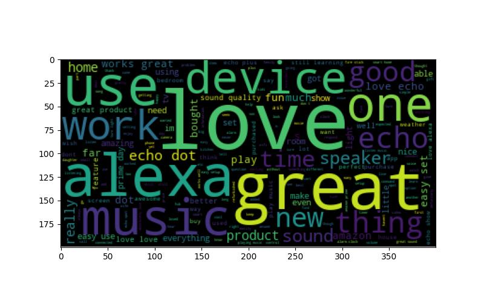
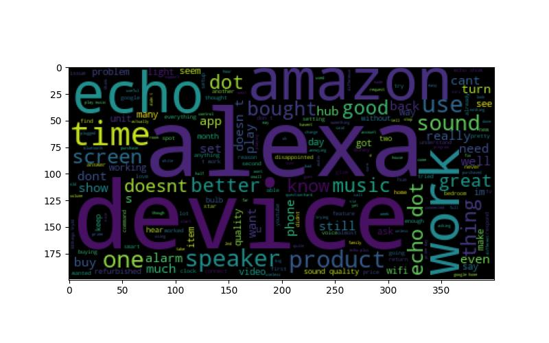

# Project description
This code mainly uses *NLTK*, *wordcloud* and *sklearn* libraries to:
* perform text cleaning for Amazon Alexa reviews: remove punctuation, remove stop words, convert to lower case
* draw word clouds for positive and negative reviews
* train three machine learning models to predict ratings based on review texts
* test machine learning models' performances

Data source: https://www.kaggle.com/datasets/sid321axn/amazon-alexa-reviews

# Example
Here are the wordcloud results for positive and negative reviews.

The machine learning classification report can be found in *classification_report.txt*.