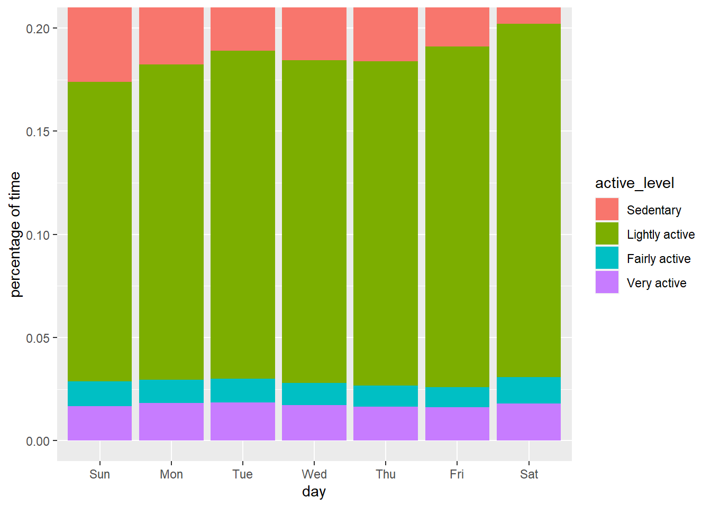

# Project description
This is my *Google Data Analytics Professional Certificate*  project.

It uses SQL (BigQuery) and R to process and analyze wellness data from fitness trackers.

The research questions include:
* Are users more active on a particular day of the week?
* Is there a relationship between sedentary time and sleep duration each day?

Data source: FitBit Fitness Tracker Data (CC0: Public Domain, dataset made available through Mobius) https://www.kaggle.com/datasets/arashnic/fitbit

# Result
Detailed analysis report can be found in *results.zip*.

Below is an example of a plot drawn with ggplot in R, answering the question: Are users more active on a particular day of the week?

